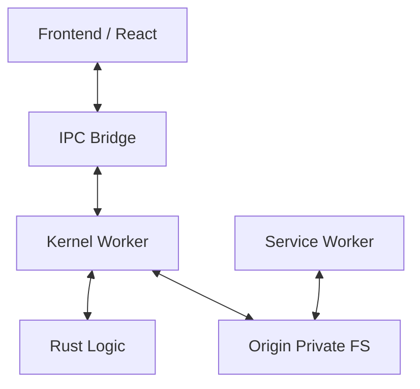

# R1 TauriWeb Runtime

> Build native-grade Tauri applications that run entirely in the browser.

R1 is a high-performance runtime that bridges the gap between native Tauri and the Web. It allows you to take your existing Tauri application structure (Rust backend + React/Vue/Svelte frontend) and deploy it to a standard web browser without a server-side backend.

## 🚀 Key Features

- 🏎️ **WASM Backend**: Run your Rust logic in a dedicated Web Worker via WebAssembly.
- 📂 **Virtual Filesystem (VFS)**: Persistent file storage using the Origin Private File System (OPFS), mapping standard Rust `std::fs` calls to the browser.
- 🪟 **Virtual Window Manager**: A native-feeling windowing system with macOS, Windows 11, and Linux themes.
- 📡 **IPC Bridge**: Drop-in compatibility with `@tauri-apps/api/tauri`'s `invoke` command.
- ⚡ **Vite Plugin**: Automatic Rust compilation (`wasm-pack`) and runtime injection via `@r1/vite-plugin`.
- 🛡️ **Isolation**: Kernel-level separation between UI and Backend for maximum stability.

## 📦 Project Structure

```text
r1-tauriweb-runtime/
├── packages/
│   ├── kernel/      # The OS for the browser (Worker-side)
│   ├── core/        # Main thread runtime and IPC bridge
│   ├── apis/        # Standard Tauri API implementations (FS, Dialog, etc.)
│   ├── sw/          # Service Worker for asset interception
│   ├── window/      # Virtual Windowing system & UI components
│   └── vite-plugin/ # Developer experience & Build automation
└── apps/
    ├── todo-demo/   # Fully functional Todo application (POC)
    └── demo/        # Showcase and technical tests
```

## 🛠️ Getting Started

We have provided detailed guides to help you start building:
- 🚀 **[GETTING_STARTED.md](./GETTING_STARTED.md)**: **The 5-Minute Quick Start Migration Guide.**
- 📖 **[USAGE_GUIDE.md](./USAGE_GUIDE.md)**: A step-by-step tutorial for your first app.
- 🏗️ **[DEVELOPER_GUIDE.md](./DEVELOPER_GUIDE.md)**: Deep technical architecture and limitations.

### Quick Start (Running the Todo Demo)

1. **Install dependencies**:
   ```bash
   npm install
   ```

2. **Build the entire workspace**:
   ```bash
   npm run build
   ```

3. **Run the demo**:
   ```bash
   cd apps/todo-demo
   npm run dev
   ```

## 📜 Architecture

R1 uses a "Kernel-Worker" architecture. The UI runs on the main thread, while the Rust logic and VFS operations run in a dedicated Web Worker. Communication happens over a high-speed IPC bridge that mimics Tauri's native protocol.



## 🛡️ License

MIT © 2026 R1 Runtime Team
